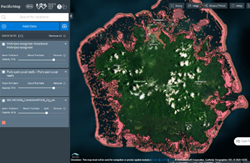
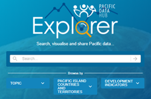
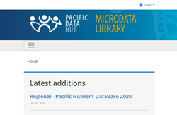

# Pacific Data Hub

The **Pacific Data Hub \(PDH**\) aims to deliver the most comprehensive collection of data and information about the Pacific and from the Pacific, including key areas such as population statistics, fisheries science, climate change adaptation, disaster risk reduction and resilience, public health surveillance, conservation of plant genetic resources for food security, and human rights.

The Pacific Data Hub is an innovative programme of work, led by the [Pacific Community \(SPC\)](https://spc.int/) and supported by the [New Zealand Ministry of Foreign Affairs and Trade](http://www.mfat.govt.nz/) and the [Australian Department of Foreign Affairs and Trade](https://www.dfat.gov.au/). It is a regional public good that provides a single authoritative point of entry for data about the Pacific and serves as a vehicle for investment in a sustainable regional data infrastructure.

We have built the Pacific Data Hub platform on our intimate understanding of the Pacific region and the enduring relationships we have forged with our members. We understand the policy and development challenges that matter to our members and we work in coordination with our development partners to not only provide quality data and evidence but also develop tools and capabilities that can inspire new insights and inform good decision-making to deliver better development outcomes.

## A Pacific Data Ecosystem

The Pacific Data Hub is part of an emerging Pacific Data Ecosystem, a partnership between Pacific Island Countries and Territories, [SPC](https://www.spc.int/) and the [Secretariat of the Pacific Regional Environment Programme \(SPREP\)](https://www.sprep.org/) to promote greater coordination in data management, dissemination and uptake initiatives. Check out the [Pacific Environment Portal](https://pacific-data.sprep.org/) for more data.

## Key Components

The Pacific Data Hub platform is made up of four key components:

1. [Data Catalogue](catalogue/)
2. [PacificMap](pacific-map/)
3. [PDH.stat](dotstat/)
4. [Microdata Library](ml/)

<table>
  <thead>
    <tr>
      <th style="text-align:left"></th>
      <th style="text-align:left"></th>
    </tr>
  </thead>
  <tbody>
    <tr>
      <td style="text-align:left">
        

        

          
        

      </td>
      <td style="text-align:left">&lt;b&gt;&lt;/b&gt;<a href="catalogue/"><b>Data Catalogue</b></a> - an
        open data repository which manages and publishes all data in the Pacific
        Data Hub. It is the central component which links to <b>PDH.stat </b>and
        the <b>Microdata Library</b>; Most spatial datasets in the Data Catalogue
        can be visualised with <b>PacificMap</b>
      </td>
    </tr>
    <tr>
      <td style="text-align:left">
        
      </td>
      <td style="text-align:left"><a href="pacific-map/"><b>PacificMap</b></a> - a geospatial data exploration
        tool providing easy-to-use map-based visualisation of spatial data;</td>
    </tr>
    <tr>
      <td style="text-align:left">
        
      </td>
      <td style="text-align:left"><a href="dotstat/"><b>PDH.stat</b> </a>- indicator database explorer which
        contains the 132 Pacific Sustainable Development Indicators (SDGs) as well
        as a range of economic, health, demographic and environmental datasets
        (replaces National Minimum Development Indicator Database - NMDI)</td>
    </tr>
    <tr>
      <td style="text-align:left">
        
      </td>
      <td style="text-align:left"><a href="ml/"><b>Microdata Library </b></a>- online census and survey
        documentation and archiving application which also provides access to microdata
        for some collections.</td>
    </tr>
  </tbody>
</table>

