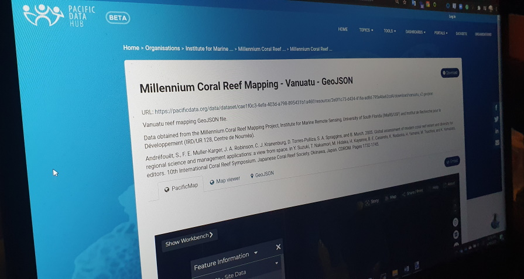

# Pacific Data Hub

## Introduction

The **Pacific Data Hub \(PDH**\), is a central repository of data **about the Pacific** and **from the Pacific**. The platform serves as a gateway to the most comprehensive collection of data and information about the Pacific across key areas including population statistics, fisheries science, climate change adaptation, disaster risk reduction and resilience, public health surveillance, conservation of plant genetic resources for food security and human rights.

## Platforms

The Pacific Data Hub is an innovative programme of work, led by the [Pacific Community \(SPC\)](https://spc.int/) and supported by the [New Zealand Ministry of Foreign Affairs and Trade](http://www.mfat.govt.nz/). The PDH serves as **a regional public good** that provides a single authoritative point of entry for data about the Pacific and serves as a vehicle for investment in **a sustainable data infrastructure for the Pacific region**.

We have built the PDH platform on **our intimate understanding of the Pacific region and the enduring relationships we have forged with our members**. We understand the policy and development challenges that matter to our members and we work in coordination with our development partners to not only provide quality data and evidence but also develop tools and capabilities that can **inspire new insights, inform good decision-making and deliver improved development outcomes.**

The PDH is part of an emerging **Pacific Data Ecosystem**, a partnership between Pacific Island Countries and Territories, SPC and the [Secretariat of the Pacific Regional Environment Programme \(SPREP\)](https://www.sprep.org/) to promote greater coordination in data management, dissemination and uptake initiatives. We work closely with our members and our development partners to strengthen data management capabilities, develop capability and improve data literacy within the Pacific region, ensuring that the data resources of our members and partners are **well-managed, shared responsibly and used ethically.**











