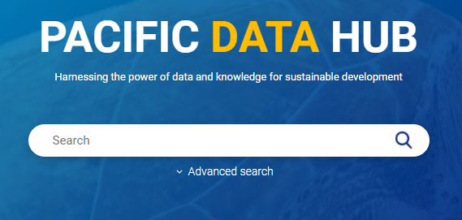
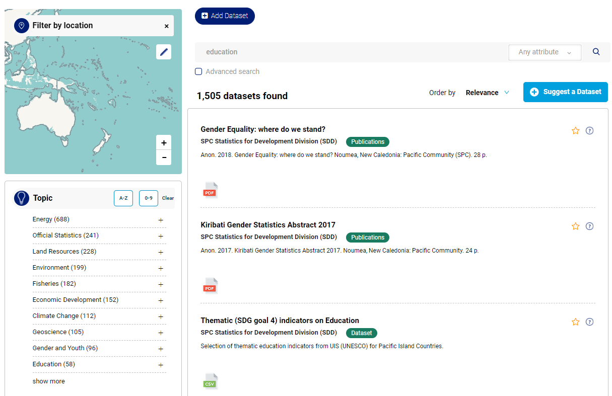

# Data Catalogue

### What is the Pacific Data Catalogue?

The Pacific Data Catalogue is the central piece of the Pacific Data Hub. It is an open data repository which manages and publishes all data in the Pacific Data Hub. Data comes from a range of sources, though is always related to the Pacific Region, and is accessible via a powerful search engine \(above\).

The Pacific Data Catalogue publishes data in units called "datasets". A dataset is a parcel of data - for example, it could be the education statistics for a country, the Exclusive Economic Zones \(EEZ's\) for the Pacific, or temperature readings from various weather stations. When users search for data, the search results they see will be individual datasets: 

Each dataset contains two main elements:

* Information or "metadata" about the data. For example, the title and publisher, date, what formats it is available in, what license it is released under, etc.
* A number of "resources", which hold the data itself. A resource can be a CSV or Excel spreadsheet, XML file, PDF document, image file, KML, GeoJSON, etc. A dataset can contain any number of resources. For example, different resources might contain the data for different years, or they might contain the same data in different formats. 

\*\*\*\*

