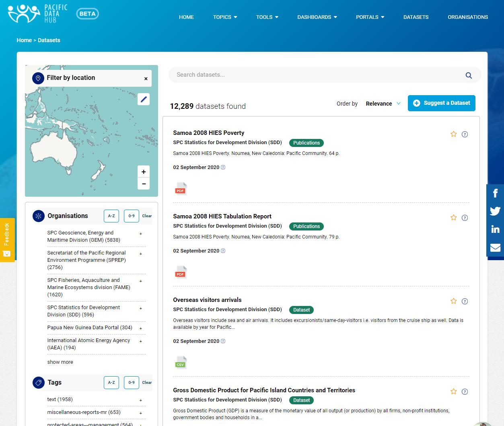

# PDH Catalogue

At the core of the Pacific Data Hub is the PDH Catalogue. This platform is built on [CKAN](https://ckan.org), the world's leading open data management system.

CKAN is a powerful data management system that makes data accessible – by providing tools to streamline publishing, sharing, finding and using data. It is used by numerous governments, organisations and communities around the world to make their data discoverable.

