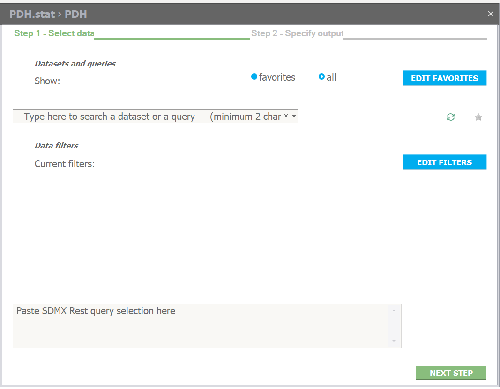
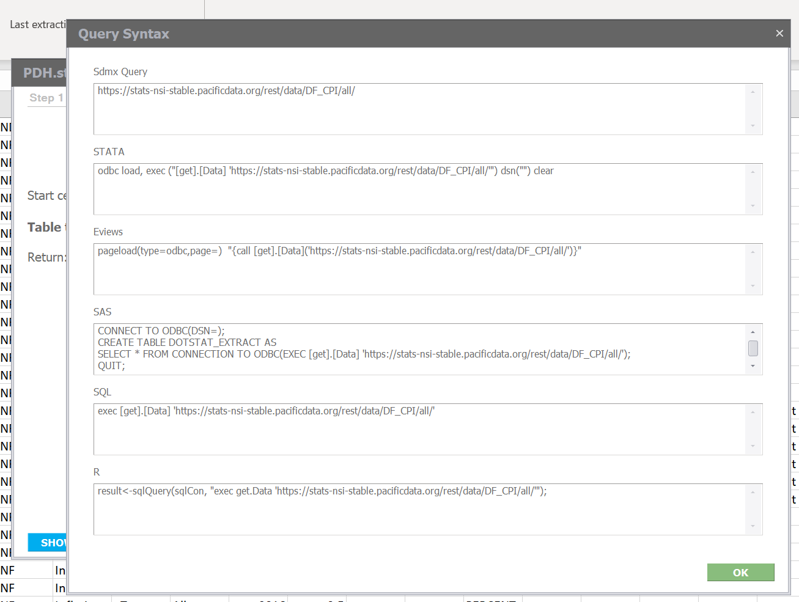

# Excel

### Installation

1: In “Stat-DLM” folder, run the “resign.bat” batch file, wait for it to finish executing

2: In “Stat-DLM” folder, run the “setup.exe” application file

3: Ignore warning pop-ups, choose “Install”

4: Open Excel and choose an existing file or make a new one

5: Find the installed add-in under the "PDH.stat" heading on the Excel Ribbon

### Basic Usage

1: Navigate to the “PDH.stat” add-in on the Excel Ribbon

2: Click “New Table” and then “PDH” to connect to the Pacific Data Hub

3: Wait while the application loads temporarily

4: A window will appear, allowing you to select data from PDH.stat

5: In “Step 1 – Select data”, under “Datasets and queries”, click the drop-down menu to select a data set

6: Depending on the selected data set, the “Data filters” will change

7: Click “EDIT FILTERS” to step through each filter and choose from the available options

8: Click “APPLY FILTERS” to finish editing filters

9: Click “NEXT STEP”

10: In “Step 2 – Specify output”, settings can be adjusted to choose where to put the data loaded from PDH.stat

11: Adjust “Start cell” to choose which Excel Sheet and cell to put the data

12: From the “Table type” menu, choose how the data should be formatted: “Flat” \(all data\), “Time Series Down” \(rows for each time period\), or "Time Series Across” \(columns for each time period\)

13: Adjust “Return” to choose whether to have “Labels” or not, and in which language. Selecting “Labels” will provide the real names for all data, otherwise the data will make use of codes. Select “Exclude Codes” to remove the codes altogether.

14: Click “GET DATA” and wait while the data is retrieved from PDH.stat

15: The data will be loaded into the selected Excel Sheet

16: To load more data, add a new Excel Sheet and repeat the above steps

### Additional Functionality

With a data set already loaded, the add-in provides extra features.

**Edit the data connection:** Select “Change Selection” to adjust the settings of the current data connection and reload the data in the same location. NOTE: this will remove the existing data in that location.

**Refresh the data connection:** Select “Current Sheet” to refresh the data in the current Sheet. Select “All Sheets” to refresh the data in all Sheets with data connections.

**Metadata on the current connection:** Information about the data connection on the current Sheet is displayed in the Ribbon under PDH.stat, including the data set code, the source, and the last extraction date.

**See the API query:** When adding a connection or changing an existing one, in “Step 2 – Specify output” there is a button showing “SHOW QUERY SYNTAX”. Select this to see how your customised filters are represented in a request to the actual PDH.stat API. The API call is shown in several different formats.

### Troubleshooting

**“This size of data exceeds MS Excel limits”:** If no filters are applied, there may be too much data to represent it in Excel \(especially if the “Table type” is set to “Time Series Down”\). To fix this, set “Table type” to “Flat” or introduce some filters so that the data set is smaller.

**“No data available for this selection”:** If very specific filters are applied, there may be an error and no data will appear. This is likely because there aren’t any data for the specified filters. To fix this, broaden the search terms and remove some filters.

### Uninstall \(Windows 10\)

1. Search “Settings” in the Windows Start Menu
2. Go to “Settings” and then navigate to “Apps”
3. Go to “Apps & features”
4. Search for “.Stat DLM”
5. Click on “.Stat DLM” and choose “Uninstall”
6. Follow the prompts to uninstall the add-in

