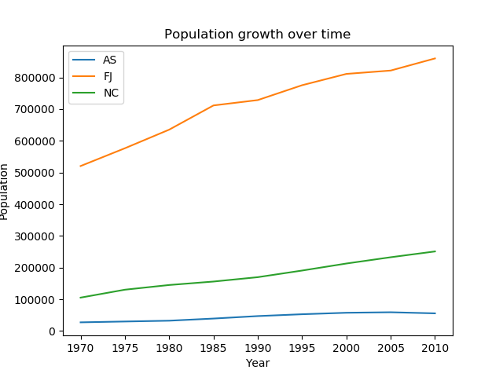

# Sample Code

Many of these tasks can be simplified through the .Stat API's suite of [plugins](../plugins/).

## **Get all dataflow IDs from PDH .Stat API**

This python script returns a list of all existing dataflowIDs. This can be useful for applications which need to check for new/updated dataflows.

```python
import requests
from bs4 import BeautifulSoup

base_url = 'https://stats-nsi-stable.pacificdata.org/rest/'

def get_endpoints(base_url):
  """
  Get the dataflowIDs of all existing dataflows in PDH .Stat API
        :param base_url: the API's base URL
        :return: list of strings
  """
  endpoints = []
  resources_url = base_url + 'dataflow/all/all/latest?detail=full'
  resp = requests.get(resources_url, verify=False)
  soup = BeautifulSoup(resp.text, 'xml')
  for name in soup.findAll('Dataflow'):
    endpoints.append(name['id'])
  return endpoints

df_ids = get_endpoints(base_url)
print(df_ids)

# Output: ['DF_COMMODITY_PRICES', 'DF_CPI', 'DF_CURRENCIES', 'DF_EMPLOYED', 'DF_EMPRATES', 'DF_GFS', 'DF_HHEXP', 'DF_IMTS', 'DF_LABEMP', 'DF_NATIONAL_ACCOUNTS', 'DF_NEET', 'DF_NMDI', 'DF_NMDI_DEV', 'DF_NMDI_EDU', 'DF_NMDI_FIS', 'DF_NMDI_HEA', 'DF_NMDI_INF', 'DF_NMDI_OTH', 'DF_NMDI_POP', 'DF_OVERSEAS_VISITORS', 'DF_POCKET', 'DF_POP_COAST', 'DF_POP_DENSITY', 'DF_POP_PROJ', 'DF_SDG', 'DF_SDG_01', 'DF_SDG_02', 'DF_SDG_03', 'DF_SDG_04', 'DF_SDG_05', 'DF_SDG_06', 'DF_SDG_07', 'DF_SDG_08', 'DF_SDG_09', 'DF_SDG_10', 'DF_SDG_11', 'DF_SDG_12', 'DF_SDG_13', 'DF_SDG_14', 'DF_SDG_15', 'DF_SDG_16', 'DF_SDG_17', 'DF_UIS', 'DF_VITAL']
```

## **Get basic metadata about a dataflow from PDH .Stat API**

This python script returns a dictionary with the title, agencyId, version for a given dataflowId. This can be useful for applications which harvest from PDH .Stat or simply need to display information about a dataset/dataflow. The function can be used iteratively for information on more than one dataflow.

```python
import requests
from bs4 import BeautifulSoup

base_url = 'https://stats-nsi-stable.pacificdata.org/rest/'
df = str(input('Enter dataflow ID: '))
# Or hard-code an example dataflow
# df = 'DF_SDG'

def basic_metadata(base_url, df):
  """
  Get some basic metadata on a dataflow in PDH .Stat API
        :param base_url: the API's base URL (string)
        :param df: the dataflow ID (string) e.g. 'DF_SDG'
        :return: dictionary of metadata key, value pairs
  """
  meta_suffix = 'latest/?references=all&detail=referencepartial'
  meta_url = '{}dataflow/all/{}/{}'.format(base_url, df, meta_suffix)
  meta = requests.get(meta_url, verify=False)
  soup = BeautifulSoup(meta.text, 'xml')
  structure = soup.find('Dataflow', attrs= {'id': df})
  meta_dict = {'dataflowId' : df}
  meta_dict['title'] = structure.find('Name').text
  meta_dict['agencyId'] = structure['agencyID']
  meta_dict['version'] = structure['version']
  return meta_dict

dict = basic_metadata(base_url, df)
print(dict)

# Output (assuming :param df is 'DF_SDG')
# {'dataflowId': 'DF_SDG', 'title': 'Sustainable Development Goals (all)', 'agencyId': 'SPC', 'version': '3.0'}
```

## **Plot time series population data \(CSV format\) from PDH .Stat API**

This python script makes a request for CSV-formatted population data over time, for a specified number of countries. It then manipulates the data and plots the results as a time series chart. It is designed to work for any number of countries, over any time period \(within API's constraints\). It could be adapted to handle other time series data.



```python
import pandas as pd
import matplotlib.pyplot as plt
import pandasdmx as sdmx

# SPC PDH .Stat as a source for pandasdmx
sdmx.add_source({
                "id": "SPC",
                "documentation":"https://stats.pacificdata.org/?locale=en",
                "url":"https://stats-nsi-stable.pacificdata.org/rest",
                "name":"Pacific Data Hub DotStat"
                })
spc = sdmx.Request('SPC')

# Design key to fetch mid-year population estimates for New Caledonia, Fiji and American Samoa
# Sex and Age are set to _T which represents total/all
key = dict(GEO_PICT=['NC', 'FJ', 'AS'], INDICATOR='MIDYEARPOPEST', SEX='_T', AGE='_T')

# Set parameters to get data from 1970 to 2015
params = dict(startPeriod='1970', endPeriod='2015')

# Make the data request and pass the key and parameters
data = spc.data('DF_POP_PROJ', key=key, params=params)

# Load as dataframe
df = sdmx.to_pandas(data)
df = df.reset_index()

# Group by country and plot the data as line charts
fig, ax = plt.subplots()
for key, grp in df.groupby(['GEO_PICT']):
    ax = grp.plot(ax=ax, kind='line', x='TIME_PERIOD', y='value', label=key)
plt.title('Population estimates 1970 to 2015')
plt.xlabel('Year')
plt.ylabel('Population')
plt.legend(loc='best')
plt.show()
```

