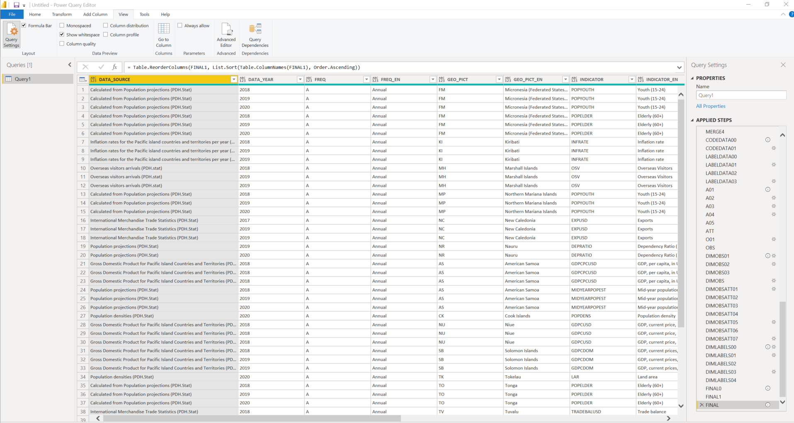

# Power BI


Get the API query corresponding to the data to be imported using the Data Explorer as explained [here](../de.md#get-api-queries-corresponding-to-the-data-selection).

Create a new data source in Power BI: Data &gt; Get Data &gt; Web &gt; Paste the API query URL

Rename the data source created by right-clicking on it and selecting "properties"

Replace the PowerQuery with the template provided below:

* Right-click on the data source and select "advanced editor"
* Copy-paste the PowerQuery template below into the editor
* Adapt the "API\_URI" variable from the query \(line 6 below\) by replacing the URL with the one obtained from PDH.stat Data Explorer, save and run \(several example queries are provided\)
* For each attribute \("column"\), a column is returned with the code values and another column is returned with the English label for the code \(see the example of the output at the bottom of this page\)

Codes and their corresponding labels will be returned in a Power BI tab. The script makes use of the “structure query” available from the Data Exporer. It could be further extended to use the metadata file attached to the dataset, accessible in the Data Explorer has explained [here](../de.md#link-to-metadata).

```c
let
    // Script to fetch data from SDMX .Stat API

    // Change API_URI to the desired API query
    // Here are some examples
    API_URI = "https://stats-nsi-stable.pacificdata.org/rest/data/SPC,DF_POCKET,3.0/A..?startPeriod=2018&endPeriod=2020&dimensionAtObservation=AllDimensions",
    //API_URI = "https://stats-nsi-stable.pacificdata.org/rest/data/SPC,DF_CPI,3.0/A.KI+FJ+PF+CK.INF.?startPeriod=2010&endPeriod=2019&dimensionAtObservation=AllDimensions",
    //API_URI = "https://stats-nsi-stable.pacificdata.org/rest/data/SPC,DF_NMDI_EDU,1.0/A.AS.._T._T._T..?startPeriod=2010&endPeriod=2018&dimensionAtObservation=AllDimensions",
    //API_URI = "https://stats-nsi-stable.pacificdata.org/rest/data/SPC,DF_IMTS,3.0/A.FJ.TB+X+M._T._T._T.USD?startPeriod=2015&endPeriod=2019&dimensionAtObservation=AllDimensions",

    // Extract dataflow name from API_URI
    DATA = Xml.Tables(Web.Contents(API_URI)),
    FULLFLOW = Text.BetweenDelimiters(API_URI, "/", "/", 4, 0),
    DATAFLOW = Text.BetweenDelimiters(FULLFLOW, ",", ","),
    // Build dataflow query (to get code names)
    STRUCT = Text.Insert("https://stats-nsi-stable.pacificdata.org/rest/dataflow/SPC//latest?references=all&detail=referencepartial", 59, DATAFLOW),
    DF = Xml.Tables(Web.Contents(STRUCT)),

    // Get code names and dimension representations from DATAFLOW

    // First get the labels for dimension representations (found in DataStructures structure)
    // These are often the dimensions which are unique to the dataset
    LABELS00 = DF{1}[Table],
    LABELS01 = LABELS00{0}[Table],
    LABELS02 = LABELS01{5}[Table],
    LABELS03 = LABELS02{0}[Table],
    LABELS04 = Table.TransformColumnTypes(LABELS03,{{"Attribute:id", type text}, {"Attribute:agencyID", type text}, {"Attribute:version", Int64.Type}, {"Attribute:isFinal", type logical}}),
    LABELS05 = LABELS04{0}[DataStructureComponents],
    LABELS06 = LABELS05{0}[DimensionList],
    LABELS07 = Table.TransformColumnTypes(LABELS06,{{"Attribute:id", type text}}),
    LABELS08 = LABELS07{0}[Dimension],
    LABELS09 = Table.TransformColumnTypes(LABELS08,{{"Attribute:id", type text}, {"Attribute:position", Int64.Type}}),
    LABELS10 = Table.ExpandTableColumn(LABELS09, "LocalRepresentation", {"Enumeration"}, {"LocalRepresentation.Enumeration"}),
    LABELS11 = Table.ExpandTableColumn(LABELS10, "LocalRepresentation.Enumeration", {"Namespace:"}, {"LocalRepresentation.Enumeration.Namespace:"}),
    LABELS12 = Table.ExpandTableColumn(LABELS11, "LocalRepresentation.Enumeration.Namespace:", {"Ref"}, {"LocalRepresentation.Enumeration.Namespace:.Ref"}),
    LABELS13 = Table.ExpandTableColumn(LABELS12, "LocalRepresentation.Enumeration.Namespace:.Ref", {"Attribute:id", "Attribute:version", "Attribute:agencyID", "Attribute:package", "Attribute:class"}, {"LocalRepresentation.Enumeration.Namespace:.Ref.Attribute:id", "LocalRepresentation.Enumeration.Namespace:.Ref.Attribute:version", "LocalRepresentation.Enumeration.Namespace:.Ref.Attribute:agencyID", "LocalRepresentation.Enumeration.Namespace:.Ref.Attribute:package", "LocalRepresentation.Enumeration.Namespace:.Ref.Attribute:class"}),
    LABELS14 = Table.RemoveColumns(LABELS13,{"ConceptIdentity", "LocalRepresentation.Enumeration.Namespace:.Ref.Attribute:version", "LocalRepresentation.Enumeration.Namespace:.Ref.Attribute:agencyID", "LocalRepresentation.Enumeration.Namespace:.Ref.Attribute:package", "LocalRepresentation.Enumeration.Namespace:.Ref.Attribute:class", "Attribute:position"}),

    // Then get all other codelist labels (found in Codelists structure)
    // These are usually common codelists
    CODES00 = DF{1}[Table],
    CODES01 = CODES00{0}[Table],
    CODES02 = CODES01{3}[Table],
    CODES03 = CODES02{0}[Table],
    CODES04 = Table.TransformColumnTypes(CODES03,{{"Attribute:id", type text}, {"Attribute:agencyID", type text}, {"Attribute:version", type text}, {"Attribute:isFinal", type logical}, {"Attribute:isPartial", type logical}}),
    CODES05 = Table.ExpandTableColumn(CODES04, "http://www.sdmx.org/resources/sdmxml/schemas/v2_1/common", {"Name"}, {"http://www.sdmx.org/resources/sdmxml/schemas/v2_1/common.Name"}),
    CODES06 = Table.ExpandTableColumn(CODES05, "http://www.sdmx.org/resources/sdmxml/schemas/v2_1/common.Name", {"Element:Text", "http://www.w3.org/XML/1998/namespace"}, {"http://www.sdmx.org/resources/sdmxml/schemas/v2_1/common.Name.Element:Text", "http://www.sdmx.org/resources/sdmxml/schemas/v2_1/common.Name.http://www.w3.org/"}),
    CODES07 = Table.ExpandTableColumn(CODES06, "http://www.sdmx.org/resources/sdmxml/schemas/v2_1/common.Name.http://www.w3.org/", {"Attribute:lang"}, {"http://www.sdmx.org/resources/sdmxml/schemas/v2_1/common.Name.http://www.w3.or.1"}),
    CODES08 = Table.ExpandTableColumn(CODES07, "Code", {"http://www.sdmx.org/resources/sdmxml/schemas/v2_1/common", "Attribute:id"}, {"Code.http://www.sdmx.org/resources/sdmxml/schemas/v2_1/common", "Code.Attribute:id"}),
    CODES09 = Table.ExpandTableColumn(CODES08, "Code.http://www.sdmx.org/resources/sdmxml/schemas/v2_1/common", {"Name"}, {"Code.http://www.sdmx.org/resources/sdmxml/schemas/v2_1/common.Name"}),
    CODES10 = Table.ExpandTableColumn(CODES09, "Code.http://www.sdmx.org/resources/sdmxml/schemas/v2_1/common.Name", {"Element:Text", "http://www.w3.org/XML/1998/namespace"}, {"Code.http://www.sdmx.org/resources/sdmxml/schemas/v2_1/common.Name.Element:Text", "Code.http://www.sdmx.org/resources/sdmxml/schemas/v2_1/common.Name.http://www.w3"}),
    CODES11 = Table.ExpandTableColumn(CODES10, "Code.http://www.sdmx.org/resources/sdmxml/schemas/v2_1/common.Name.http://www.w3", {"Attribute:lang"}, {"Code.http://www.sdmx.org/resources/sdmxml/schemas/v2_1/common.Name.http://www..1"}),
    CODES12 = Table.RemoveColumns(CODES11,{"http://www.sdmx.org/resources/sdmxml/schemas/v2_1/common.Name.Element:Text", "http://www.sdmx.org/resources/sdmxml/schemas/v2_1/common.Name.http://www.w3.or.1", "Attribute:isPartial", "Attribute:isFinal", "Attribute:version", "Attribute:agencyID"}),
    // English terms here, but French is also possible
    CODES13 = Table.SelectRows(CODES12, each ([#"Code.http://www.sdmx.org/resources/sdmxml/schemas/v2_1/common.Name.http://www..1"] = "en")),
    CODES14 = Table.RemoveColumns(CODES13,{"Code.http://www.sdmx.org/resources/sdmxml/schemas/v2_1/common.Name.http://www..1"}),
    // Rename and clean
    CODES15 = Table.RenameColumns(CODES14,{{"Code.http://www.sdmx.org/resources/sdmxml/schemas/v2_1/common.Name.Element:Text", "RealName"}}),
    CODES16 = Table.TransformColumnTypes(CODES15,{{"RealName", type text}, {"Code.Attribute:id", type text}, {"Attribute:id", type text}}),
    CODES17 = Table.Distinct(CODES16),
    // Create a key of CODES + LABELS for joining with data
    CODES18 = Table.NestedJoin(CODES17, {"Attribute:id"}, LABELS14, {"LocalRepresentation.Enumeration.Namespace:.Ref.Attribute:id"}, "Attribute", JoinKind.LeftOuter),
    CODES19 = Table.ExpandTableColumn(CODES18, "Attribute", {"LocalRepresentation.Enumeration.Namespace:.Ref.Attribute:id", "Attribute:id"}, {"Attribute.LocalRepresentation.Enumeration.Namespace:.Ref.Attribute:id", "Attribute.Attribute:id"}),
    CODES20 = Table.AddColumn(CODES19, "Adjusted.Attribute", each if [#"Attribute.Attribute:id"] = null then Text.Range([#"Attribute:id"], 7) else [#"Attribute.Attribute:id"]),
    CODES21 = Table.AddColumn(CODES20, "Key", each Text.Combine({[#"Code.Attribute:id"], [#"Adjusted.Attribute"]}, "_")),
    CODES22 = Table.RemoveColumns(CODES21,{"Adjusted.Attribute", "Attribute.Attribute:id", "Attribute.LocalRepresentation.Enumeration.Namespace:.Ref.Attribute:id", "Attribute:id"}),

    // Set up data source
    T00 = DATA{1}[Table],
    T01 = Table.TransformColumnTypes(T00,{{"Attribute:action", type text}, {"Attribute:structureRef", type text}}),
    T02 = T01{0}[#"http://www.sdmx.org/resources/sdmxml/schemas/v2_1/data/generic"],
    T03 = T02{0}[Obs],
    T04 = Table.AddIndexColumn(T03, "Index", 1, 1),
    T05 = Table.ExpandTableColumn(T04, "ObsValue", {"Attribute:value"}, {"ObsValue.Attribute:value"}),
    T06 = Table.ExpandTableColumn(T05, "ObsKey", {"Value"}, {"ObsKey.Value"}),
    T07 = Table.RemoveColumns(T06,{"ObsValue.Attribute:value", "Attributes"}),
    T08 = Table.ExpandTableColumn(T07, "ObsKey.Value", {"Attribute:id", "Attribute:value"}, {"ObsKey.Value.Attribute:id", "ObsKey.Value.Attribute:value"}),
    // Create a unique key identifier: Code_CodeCategory "FJ_GEO_PICT"
    T09 = Table.AddColumn(T08, "Key", each Text.Combine({[#"ObsKey.Value.Attribute:value"], [#"ObsKey.Value.Attribute:id"]}, "_")),

    // Merge data source T08 with codes CODES22

    // Left Outer join: adds a column with the real name for each code
    MERGE0 = Table.NestedJoin(T09, {"Key"}, CODES22, {"Key"}, "Codelists", JoinKind.LeftOuter),
    MERGE1 = Table.ExpandTableColumn(MERGE0, "Codelists", {"RealName"}, {"Codelists.RealName"}),
    // If a real name wasn't found, just replace null with the code itself
    MERGE2 = Table.AddColumn(MERGE1, "Cleaned", each if [Codelists.RealName] = null then [#"ObsKey.Value.Attribute:value"] else [Codelists.RealName]),
    MERGE3 = Table.RenameColumns(MERGE2, {{"ObsKey.Value.Attribute:value", "Code"}}),
    MERGE4 = Table.RemoveColumns(MERGE3,{"Codelists.RealName", "Key"}),

    // Pivot to wide-format with a column for each type of Attribute
    
    // To preserve both codes and labels, CODEDATA will take only CODES while LABELDATA will take real labels
    CODEDATA00 = Table.RemoveColumns(MERGE4,{"Cleaned"}),
    CODEDATA01 = Table.Pivot(CODEDATA00, List.Distinct(CODEDATA00[#"ObsKey.Value.Attribute:id"]), "ObsKey.Value.Attribute:id", "Code"),

    LABELDATA00 = Table.RemoveColumns(MERGE4,{"Code"}),
    LABELDATA01 = Table.AddColumn(LABELDATA00, "Label_Column", each Text.Combine({[#"ObsKey.Value.Attribute:id"], "_EN"})),
    LABELDATA02 = Table.RemoveColumns(LABELDATA01,{"ObsKey.Value.Attribute:id"}),
    LABELDATA03 = Table.Pivot(LABELDATA02, List.Distinct(LABELDATA02[#"Label_Column"]), "Label_Column", "Cleaned"),

    // Get attribute values and observation values
    A01 = Table.RemoveColumns(T06,{"ObsKey.Value", "ObsValue.Attribute:value"}),
    A02 = Table.ExpandTableColumn(A01, "Attributes", {"Value"}, {"Attributes.Value"}),
    A03 = Table.ExpandTableColumn(A02, "Attributes.Value", {"Attribute:id", "Attribute:value"}, {"Attributes.Value.Attribute:id", "Attributes.Value.Attribute:value"}),
    A04 = Table.ReplaceValue(A03,null,"",Replacer.ReplaceValue,{"Attributes.Value.Attribute:id"}),
    A05 = Table.Pivot(A03, List.Distinct(A04[#"Attributes.Value.Attribute:id"]), "Attributes.Value.Attribute:id", "Attributes.Value.Attribute:value"),
    ATT = Table.RemoveColumns(A05,{""},1),

    O01 = Table.ExpandTableColumn(T05, "ObsKey", {"Value"}, {"ObsKey.Value"}),
    OBS = Table.RemoveColumns(O01,{"ObsKey.Value", "Attributes"}),

    // Merge Codes with data
    DIMOBS01 = Table.NestedJoin(CODEDATA01, {"Index"}, OBS, {"Index"}, "OBS", JoinKind.Inner),
    DIMOBS02 = Table.ExpandTableColumn(DIMOBS01, "OBS", {"ObsValue.Attribute:value"}, {"OBS.ObsValue.Attribute:value"}),
    DIMOBS03 = Table.RenameColumns(DIMOBS02,{{"OBS.ObsValue.Attribute:value", "OBS_VALUE"}}),
    DIMOBS   = Table.ReplaceValue(DIMOBS03,null,"",Replacer.ReplaceValue,{"OBS_VALUE"}),

    DIMOBSATT01 = Table.NestedJoin(DIMOBS, {"Index"}, ATT, {"Index"}, "ATT", JoinKind.Inner),
    DIMOBSATT02 = Table.RemoveColumns(DIMOBSATT01,{"Index"}),
    DIMOBSATT03 = Table.ExpandTableColumn(DIMOBSATT02, "ATT", List.Union(List.Transform(DIMOBSATT02[ATT], each Table.ColumnNames(_)))),
    DIMOBSATT04 = Table.RemoveColumns(DIMOBSATT03,{"Index"}),
    DIMOBSATT05 =Table.TransformColumnTypes(DIMOBSATT04,{{"OBS_VALUE", type number}}, "us-EN"),
    DIMOBSATT06 = Table.TransformColumnTypes(DIMOBSATT05,{{"TIME_PERIOD", type date}}),
    DIMOBSATT07 = Table.AddIndexColumn(DIMOBSATT06, "Index", 1, 1),

    // Merge labels with data
    DIMLABELS00 = Table.NestedJoin(LABELDATA03, {"Index"}, OBS, {"Index"}, "OBS", JoinKind.Inner),
    DIMLABELS01 = Table.ExpandTableColumn(DIMLABELS00, "OBS", {"ObsValue.Attribute:value"}, {"OBS.ObsValue.Attribute:value"}),
    DIMLABELS02 = Table.RenameColumns(DIMLABELS01,{{"OBS.ObsValue.Attribute:value", "OBS_VALUE_EN"}}),
    DIMLABELS03   = Table.ReplaceValue(DIMLABELS02,null,"",Replacer.ReplaceValue,{"OBS_VALUE_EN"}),
    DIMLABELS04 = Table.RemoveColumns(DIMLABELS03, {"OBS_VALUE_EN", "TIME_PERIOD_EN"}),

    // Join label columns and code columns
    FINAL0 = Table.Join(DIMOBSATT07, "Index", DIMLABELS04, "Index", JoinKind.Inner),
    FINAL1 = Table.RemoveColumns(FINAL0, {"Index"}),
    // Reorder columns to have each set of codes and labels side by side
    FINAL = Table.ReorderColumns(FINAL1, List.Sort(Table.ColumnNames(FINAL1), Order.Ascending))
in
    FINAL
```

An example of the output in Power BI is shown below:



