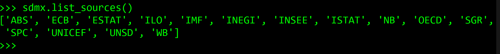

# Python

.png>)

### Overview

PDH.stat is part of the `sdmx` Python package developed by Paul Natsuo Kishimoto. More information about the package can be found [here](https://sdmx1.readthedocs.io/en/latest/index.html).

### Install sdmx

These steps have been tested with Python 3.7.4 in an Anaconda environment on Windows 10.

Start by installing sdmx. To learn more about the package, see the code [here](https://github.com/khaeru/sdmx).

To install with pip from the command prompt (note: include the '1' at the end of sdmx): `pip install sdmx1`

In a Python project, import the package: `import sdmx`

### Connect to PDH.stat

To see the available sources and find PDH.stat:

```python
import sdmx
sdmx.list_sources()
```

The source abbreviation for PDH.stat is "SPC" (Pacific Community), as shown below.&#x20;



To connect to PDH.stat and then view its available data flows:

```python
spc = sdmx.Client('SPC')
datasets = sdmx.to_pandas(spc.dataflow().dataflow)
datasets
```


To connect to a data flow and convert it into a pandas Multi-index series:

```python
data = spc.data('DF_CPI')
df = sdmx.to_pandas(data)
df
```


And then to turn the series into a dataframe, reset the index:

```python
df = df.reset_index()
df
```


For an example of how to use the plugin in combination with the API key and parameter settings, see the [time series plot example](../api/scode.md#plot-time-series-population-data-using-the-python-plugin-with-pdh-stat-api).
