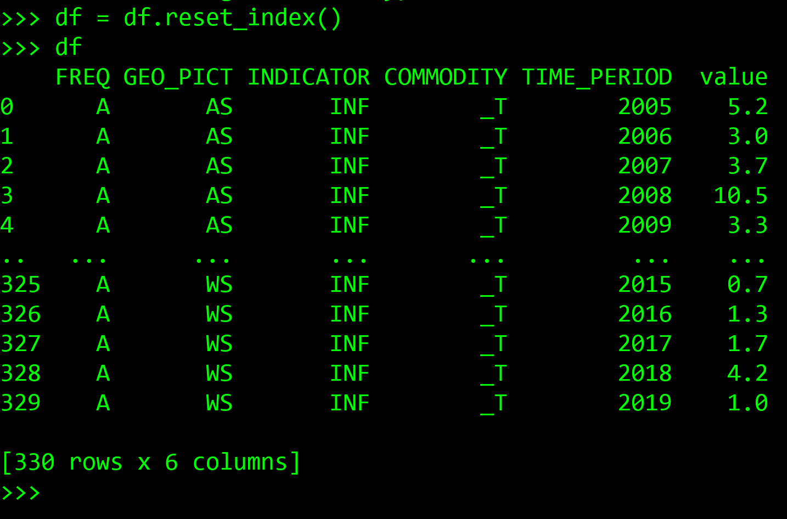

# Python


### Install pandaSDMX

### Install pandaSDMX

### Install pandaSDMX

These steps have been tested with Python 3.7.4 in an Anaconda environment on Windows 10.

Start by installing pandaSDMX. To learn more about pandaSDMX, see the documentation [here](https://pandasdmx.readthedocs.io/en/v1.0/) or the code [here](https://github.com/dr-leo/pandaSDMX).

To install with pip from the command prompt: `pip install pandasdmx`

To install from an Anaconda environment: `conda install pandasdmx -c conda -forge`

In a Python project, import the package: `import pandasdmx as sdmx`

### Connect to PDH.stat

To establish a connection to PDH.stat in a project using pandasdmx, use the code snippet below:

```python
import pandasdmx as sdmx
sdmx.add_source({
                "id": "SPC", 
                "documentation":"https://stats.pacificdata.org/?locale=en", 
                "url":"https://stats-nsi-stable.pacificdata.org/rest", 
                "name":"Pacific Data Hub DotStat"
                })
```

To see the available sources and check for PDH.stat:

```python
sdmx.list_sources()
```

The source abbreviation for PDH.stat is "SPC" \(Pacific Community\), as shown below. 


To connect to PDH.stat and then view its available data flows:

```python
spc = sdmx.Request('SPC')
datasets = sdmx.to_pandas(spc.dataflow().dataflow)
datasets
```


To connect to a data flow and convert it into a pandas Multi-index series:

```python
data = spc.data('DF_CPI')
df = sdmx.to_pandas(data)
df
```


And then to turn the series into a dataframe, reset the index:

```python
df = df.reset_index()
df
```



For an example of how to use the plugin in combination with the API key and parameter settings, see the [time series plot example](../api/scode.md#plot-time-series-population-data-using-the-python-plugin-with-pdh-stat-api).

