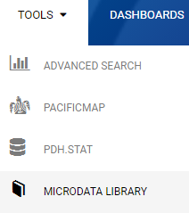
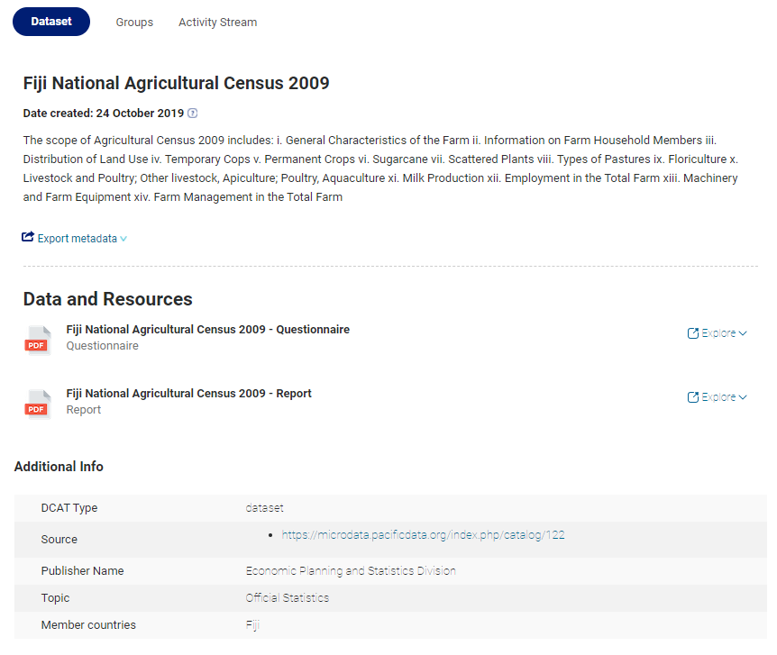
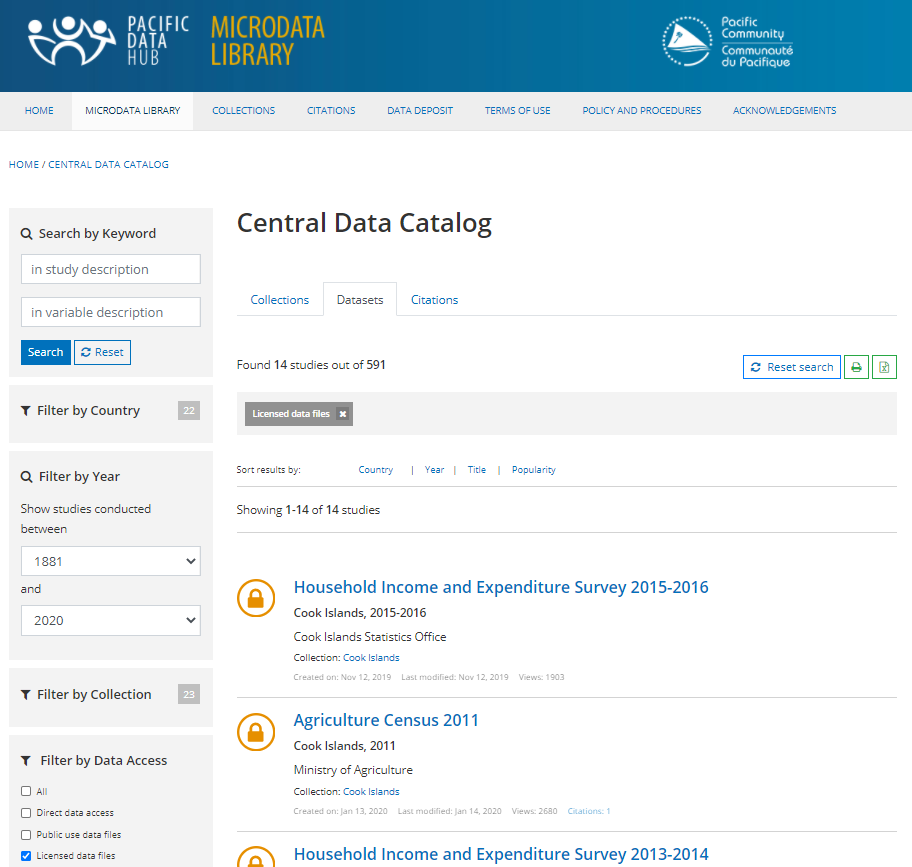
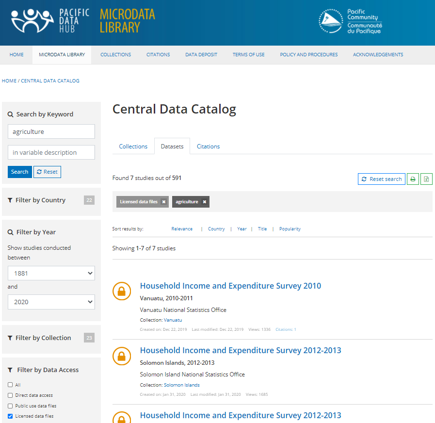

# Microdata Library

For an introduction on how to use the Microdata Library see this video :



## Access the Microdata Library

### Directly via Microdata Library URL

The Microdata Library is accessible using the following URL:

[https://microdata.pacificdata.org/](https://microdata.pacificdata.org/)

### From the Data Catalogue

The application is also accessible in several ways from the [Data Catalogue](https://pacificdata.org/):

A link is available from the "Tools" menu:

PDH Data Catalogue entries have a link to visualize the data in the Microdata Library as a source:

## Find studies using the Microdata Library Central Catalog

The Microdata Library Central Data Catalog allows users to search for published studies \(censuses and surveys\).

 

A keyword search returns datasets containing the given keyword\(s\) in titles and descriptions. The variable description can also be used to search in more detail.

### From the Pacific Data Hub Data Calalogue

The Microdata Library is registered in the Data Catalogue and can also be found using its various different functionnalities. For more information see [dedicated section on the use of the Data Catalogue](https://app.gitbook.com/@pacific-community-spc/s/pacific-data-hub/~/drafts/-MJz0A5FvX84FSq5yBMJ/catalogue).

## Explore a study

## Access microdata

