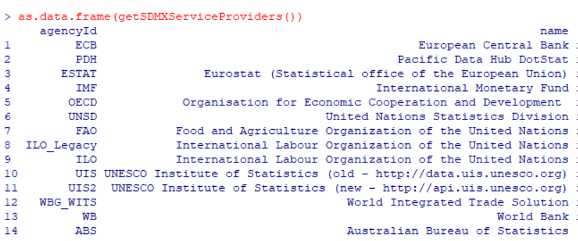
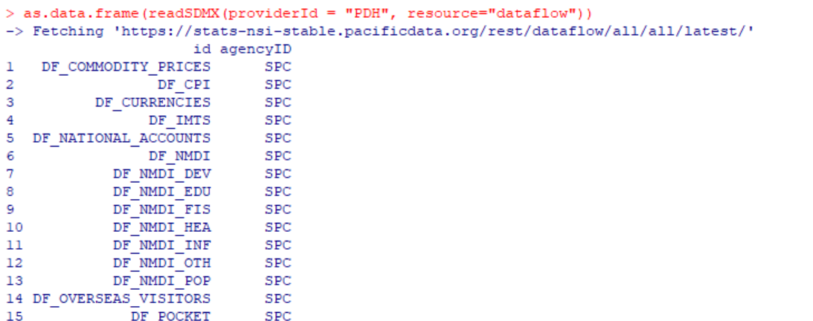
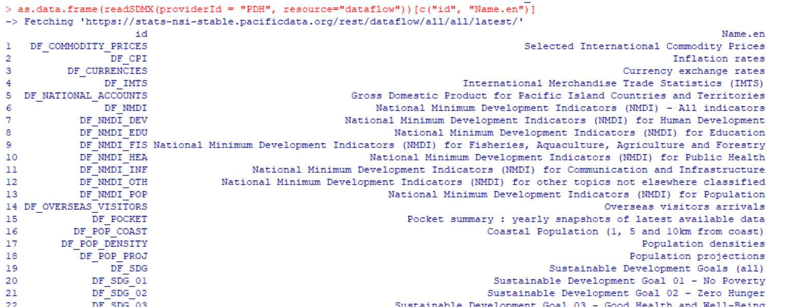
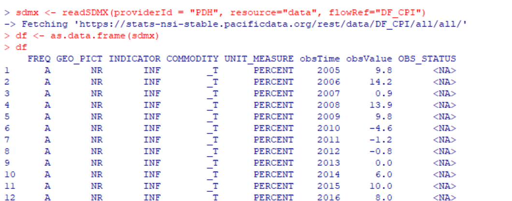
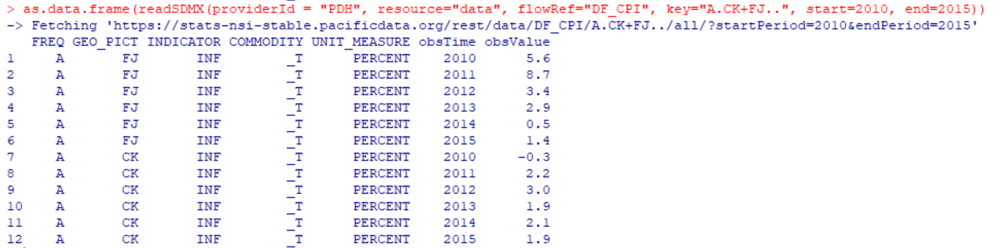

# R

### Overview

The package is an adaptation of the `rsdmx` package developed by Emmanuel Blondel, and contributors Matthieu Stigler and Eric Persson. Learn more about the original package [here](https://github.com/opensdmx/rsdmx). It has been configured to include Pacific Data Hub's .Stat API as a default service provider. Full credit goes to the original authors, who can be cited at[](http://doi.org/10.5281/zenodo.592404)

### Installation

These steps have been tested with R 4.0.2 on Windows 10.

Remove rsdmx if already installed: `remove.packages("rsdmx")`

Install devtools: `install.packages("devtools")`

Install rsdmx from the PDH.stat version of the package on Github: `devtools::install_github("PacificCommunity/rsdmx")`

### Basic Usage

This is a quick-start guide. Go [here ](https://github.com/PacificCommunity/rsdmx)for the full documentation and code.

Load package: `library(rsdmx)`

**See all service providers**

Aside from PDH.stat, the original package offers connectivity with OECD, Eurostat and others. See all available service providers with the `getSDMXServiceProviders()` function.

```r
as.data.frame(getSDMXServiceProviders())
```



**See available dataflows from PDH.stat**

To see the available PDH.stat dataflows \(data sets\), use the `readSDMX()` function, setting the `providerId` parameter to "PDH" and the `resource` parameter to "dataflow":

```r
as.data.frame(readSDMX(providerId="PDH", resource="dataflow"))
```



To return the available data set IDs and their English names, filter the dataframe:

```r
as.data.frame(readSDMX(providerId="PDH", resource="dataflow"))[c("id", "Name.en")]
```



**Get all data for a dataflow**

To retrieve a dataflow, provide the dataflow ID to the `readSDMX()` function in the `flowref` parameter, also setting the `resource` as "data".

For example, to connect to "Inflation Rates" dataflow, the ID is "DF\_CPI" \(as shown when retrieving all the dataflows for PDH.stat\):

```r
sdmx <- readSDMX(providerId="PDH", resource="data", flowRef="DF_CPI")
df <- as.data.frame(sdmx)
```



**Get more specific data for a dataflow**

Extra parameters can be supplied the `readSDMX()` function to retrieve a filtered view of the dataflow:

* `start` is the desired start year \(supplied as an integer\)
* `end` is the desired end year \(supplied as an integer\)
* `key` controls a variety of filters, and by default it is set to "all" \(retrieves all data\). A further explanation is provided below.

The `key` parameter controls a different number of variables depending on the dataflow, including time period, country, currency and others. Each variable is selected with a code, and separated by a dot `.` Two dots `..` indicates a "wildcard" \(selects all available values\). A plus `+` can allow multipled variables to be selected. Generally the time period comes first, `A` for "annual" or `M` for "month" \(if the data is available at that level\). Some examples:

* For `DF_CPI` "Inflation Rates" dataflow, to get annual data from 2010-2015 for Cook Islands and Fiji:
  * The `key` is `"A.CK+FJ.."`
  * `start` is 2010 and `end` is 2015
  * The R code:

```r
as.data.frame(readSDMX(providerId = "PDH", 
                resource="data", 
                flowRef="DF_CPI", 
                key="A.CK+FJ..", 
                start=2010, 
                end=2015))
```

Given that the `key` variables can change depending on the dataflow, it can be easier to retrieve all data and then filter manually in R. Alternatively, use the [Data Explorer](https://stats.pacificdata.org/?locale=en) to filter a dataset and then view the relevant API call and key.



